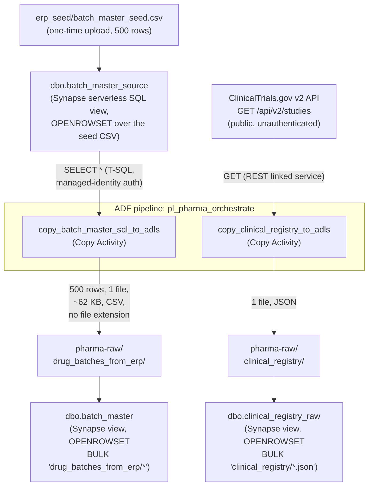
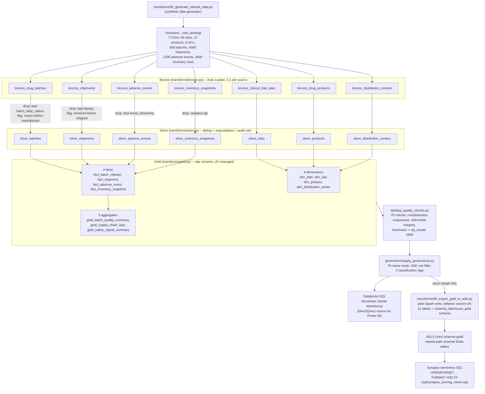

# Data Flow

How data actually moves through each half of this project, step by step,
with the real row counts and file shapes seen while testing it (not
estimates). See [architecture.md](architecture.md) for the system-level
diagram and the two subsystems' relationship; this doc goes one level
deeper into each.

## ADF: source → Synapse/API → ADLS Gen2

**Step by step:**

1. `erp_seed/batch_master_seed.csv` was uploaded once (`az storage blob
   upload`, AAD auth, no key) — a stand-in ERP extract, since Synapse
   serverless SQL has no persisted storage engine of its own to hold a real
   writable source table (see [architecture.md](architecture.md)).
2. `dbo.batch_master_source` is a Synapse view over that CSV — this is what
   ADF's Copy Activity actually queries, via T-SQL, exactly as it would
   query a real Azure SQL DB table.
3. **`copy_batch_master_sql_to_adls`** runs `SELECT *` against that view
   (`AzureSqlDatabaseLinkedService`, `authenticationType:
   SystemAssignedManagedIdentity` — no password) and writes the result to
   `pharma-raw/drug_batches_from_erp/` as a single CSV. Verified via the
   activity's own run diagnostics: **500 rows read, 500 rows written, 1
   file, ~62 KB**. The output file gets an auto-generated name with **no
   extension** (the sink dataset only specifies a folder path) — worth
   knowing if you're writing your own `OPENROWSET` against it.
4. **`copy_clinical_registry_to_adls`** calls the public ClinicalTrials.gov
   API (`RestServiceLinkedService`, anonymous auth) and writes the JSON
   response to `pharma-raw/clinical_registry/`.
5. Two Synapse views read the *landed files* back out, independent of the
   pipeline that produced them: `dbo.batch_master` (500 rows) and
   `dbo.clinical_registry_raw` (4 records, one per API result on this run).

Every hop uses managed-identity or Azure AD auth — see
[architecture.md § Discoveries from testing this for real](architecture.md#discoveries-from-testing-this-for-real)
for the four separate grants it actually took to get step 3 working
(storage RBAC, a SQL login, a bulk-operations grant, and a credential
reference grant — each one only surfaced by running the pipeline and
reading the next error).

## Databricks: synthetic source → bronze → silver → gold → serving

**Step by step (row counts from a real verified run):**

1. **Generate** (`generate_sample_data` task): writes 7 CSVs straight into
   the UC Volume — 60 clinical trial sites, 12 drug products, 8 distribution
   centers, 500 batches, 4,000 shipments, 1,200 adverse events, 3,600
   inventory snapshots (90 days × 8 DCs × 5 sampled products).
2. **Bronze** (`run_pipeline` task, first stage): Auto Loader picks up each
   CSV as-is, adding `_ingested_ts` and `_source_file` — one bronze table
   per source entity, no business logic.
3. **Silver**: deduplicated on primary key, tagged with `_source_system`
   (which upstream system each entity would really come from — CTMS, ERP,
   WMS, MES, SAFETY_DB) and `_valid_from`, with Lakeflow expectations
   enforced per table (some rows dropped outright, others flagged but kept —
   see the per-table rules in `transforms/silver.py`).
4. **Gold**: joins and aggregates silver into a star schema — 4 dimensions,
   4 facts, 3 pre-aggregated business summaries (11 tables total), all
   Unity-Catalog-managed (an explicit storage `path=` here is rejected
   outright by Lakeflow under UC governance — see
   [architecture.md](architecture.md)).
5. **Data quality** (`run_data_quality_checks` task): 25 checks across
   completeness, uniqueness, referential integrity, and freshness, logged
   to `dq_results` — **25/25 passing** on every verified run. Any failure
   fails the whole job rather than shipping bad data downstream.
6. **Governance** (`apply_governance` task): column mask on
   `dim_site.principal_investigator`, row filter restricting `severity =
   'SAE'` rows in `fact_adverse_event`, and 4 classification tags — all
   gated on `is_account_group_member('admins')`.
7. **Serving, path A — Databricks SQL**: the gold tables (still
   UC-managed, governed) are queried directly by the Serverless Starter
   Warehouse; Power BI DirectQueries this.
8. **Serving, path B — Synapse (`azure` target only)**: `export_gold_to_adls`
   copies all 11 gold tables to `pharma-gold` as named-path external Delta
   tables (deletion vectors explicitly disabled at write time — Synapse's
   Delta reader can't handle that protocol feature), registered under a
   separate `pharma_lakehouse_gold` schema. Synapse serverless SQL reads
   these directly via `OPENROWSET ... FORMAT = 'DELTA'` — verified with a
   real cross-table `JOIN` (`gold_safety_signal_summary` × `dim_product`,
   440 rows) returning correct results with no ETL in between.

**Note on the export copies:** step 8's tables are physically separate from
the governed originals in step 6 — the mask/row filter apply to
`pharma_lakehouse.*`, not automatically to `pharma_lakehouse_gold.*`. Anyone
querying the export schema directly (including via Synapse) sees ungoverned
data. Documented tradeoff, not a hidden gap — see
[architecture.md § Decision 3](DESIGN.md#decision-3-gold-tables-stay-uc-managed-a-separate-export-step-lands-named-path-copies).

## Why these two flows don't connect to each other

Bronze (Databricks side) ingests the synthetic generator's output, not the
files ADF lands in `pharma-raw`. See
[architecture.md § What's still decoupled, on purpose](architecture.md#whats-still-decoupled-on-purpose)
for why that's a deliberate choice, not an oversight — and exactly what
change would connect them if you wanted to.
