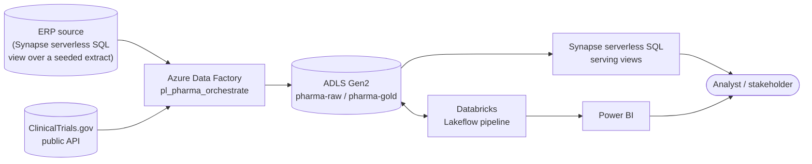

# High-Level Design (HLD)

**Status of this document:** reflects the system as it stands today, not as
originally planned — the `azure` Databricks target was decommissioned on
2026-08-29 (see §7). Where design intent and current reality differ, this
doc says so explicitly rather than describing an aspirational state.

## 1. Purpose

A synthetic pharma supply-chain / clinical-safety data platform, built to
demonstrate the full breadth of an Azure Data Engineer role: multi-source
ingestion, a governed lakehouse, data quality enforcement, a BI serving
layer, IaC, and CI/CD — on real (not toy) Azure infrastructure. Full
rationale and the decisions behind this shape: [DESIGN.md](DESIGN.md).

## 2. Scope

**In scope:** ingestion from a database source (Synapse serverless SQL) and
a public REST API; a medallion lakehouse (bronze/silver/gold) with data
quality gates and Unity Catalog governance; a dual serving layer (Databricks
SQL + Synapse SQL); IaC for the new resources; a CI/CD pipeline definition.

**Out of scope:** ML/predictive modeling, formal GxP computer-system
validation, production SLAs/DR, Power Apps/Power Platform. Full list:
[DESIGN.md §3](DESIGN.md#3-non-goals).

## 3. System context

Two independent producer/consumer chains feed the same storage account:
ADF (raw, still fully live) and Databricks (transformed/governed, currently
only running against a $0 reference workspace — see §7).

## 4. Major components

| Component | Technology | Responsibility | Status |
|---|---|---|---|
| Orchestration | Azure Data Factory (`adf-c360-legacy`) | Query the DB source + call the API, land both to ADLS | **Live** |
| Storage | ADLS Gen2 (`stc360legacyws`) | Landing zone (`pharma-raw`) and gold serving copy (`pharma-gold`) | **Live** |
| Transformation | Databricks Lakeflow Declarative Pipelines | Bronze → silver → gold medallion pipeline | **Live** on the `dev` ($0 AWS Free Edition) target; `azure` target decommissioned |
| Data quality | Databricks notebook (`dq/`) | 25 completeness/uniqueness/RI/freshness checks, fails the job on any failure | **Live** (dev target) |
| Governance | Unity Catalog (`governance/`) | Column masks, row filters, tags | **Live** (dev target) |
| Serving — Databricks | Databricks SQL Warehouse | Power BI DirectQuery source | Requires a live workspace — currently only `dev` |
| Serving — Synapse | Synapse serverless SQL (`synapse-c360-legacy`) | T-SQL views over raw extracts (live) and gold Delta (static since decommission) | **Raw: live. Gold: static snapshot** |
| IaC | Bicep (`infra/`) | Resource provisioning (`main.bicep`) and RBAC (`rbac.bicep`), kept separate | Applied |
| CI/CD | Azure DevOps pipeline definition (`devops/azure-pipelines.yml`) | test → validate → deploy infra → deploy lakehouse → deploy ADF | **Defined, not yet connected to a live Azure DevOps org/project** |

## 5. Technology stack

- **Compute:** Azure Databricks (Premium, decommissioned) / Databricks Free
  Edition (AWS, live), Azure Data Factory, Synapse serverless SQL.
- **Storage:** ADLS Gen2, Unity Catalog managed storage.
- **Governance:** Unity Catalog (masks, row filters, tags), managed-identity
  auth throughout — no passwords or storage keys anywhere in the repo.
- **IaC:** Bicep.
- **CI/CD:** Azure DevOps YAML pipelines (defined; not deployed).
- **Languages:** PySpark/Python (transforms, DQ, governance, data
  generation), T-SQL (Synapse serving layer), Python (ADF deployment via
  `azure-mgmt-datafactory`).
- **BI:** Power BI (DirectQuery).

## 6. High-level data flow

See [DATA_FLOW.md](DATA_FLOW.md) for step-by-step diagrams with real row
counts. Summary: ADF lands a DB extract and an API response into ADLS raw;
independently, Databricks generates/ingests its own synthetic source data
through bronze → silver → gold, gates it on 25 DQ checks, applies UC
governance, and (only when the `azure` target is live) exports gold to the
same ADLS account for Synapse to serve. The two chains are **not**
pipeline-connected — see [architecture.md § What's still decoupled, on
purpose](architecture.md#whats-still-decoupled-on-purpose).

## 7. Deployment topology and current state

| Target | Workspace | Live? |
|---|---|---|
| `dev` | `medallion` — Databricks Free Edition (AWS) | **Yes**, $0 |
| `azure` | `pharmalake-dbx` — Azure Databricks Premium | **No** — deleted 2026-08-29 |

The `azure` target was decommissioned because Azure now auto-attaches a NAT
Gateway to *any* new Databricks workspace (a platform-wide default-outbound
retirement change, unrelated to this project's VNet configuration), which
billed a standing ~₹1,500/month regardless of usage. There was no in-place
fix — only delete the workspace or accept the charge. All data behind it was
synthetic and regeneratable, so deletion was the correct call. Redeploying
is one `az deployment group create` plus uncommenting the `azure` block in
`databricks.yml` (kept, commented, for exactly this reason).

**Consolidation on `dev`:** after the decommission, `dev`'s catalog was
changed from the generic `workspace` default to a dedicated `pharmalake_dbx`
catalog (matching the deleted Azure workspace's naming), so the project
reads consistently regardless of which underlying workspace it runs on.
This required deleting and recreating the Lakeflow pipeline object — Unity
Catalog rejects an in-place catalog change on an existing pipeline
(`PERMISSION_DENIED: Can not move tables across arclight catalogs`); see
[RUNBOOK.md](RUNBOOK.md#trigger-and-verify-databricks-pipeline) for the
mechanics. Verified live: 4,000 shipments, 1,200 adverse events, 500
batches, 25/25 DQ checks passing under `pharmalake_dbx.pharma_lakehouse`.

**Consequence for Synapse's gold-layer views:** the Delta files under
`pharma-gold` are a static snapshot from the last `azure`-target run — they
still resolve and return correct historical data, but nothing refreshes them
anymore. The raw-layer integration (ADF → `pharma-raw` → Synapse) is
unaffected and fully live, since it never depended on the Databricks
workspace.

## 8. Non-functional considerations

- **Cost:** real spend tracked via Azure Cost Management, not estimated —
  see [architecture.md § Cost](architecture.md#cost-real-numbers-not-just-estimates).
  A $25/month budget alert is active on the resource group regardless.
- **Security:** managed-identity/Azure AD auth only; no secrets committed.
  IAM changes (RBAC role assignments, SQL grants) are kept in dedicated,
  reviewable files/scripts rather than folded into general deployment.
- **Availability:** no SLA — portfolio project, not production. Serverless
  compute everywhere means no standing infrastructure to fail.
- **Scalability:** not a design goal at this data volume (thousands of
  rows); the medallion/star-schema pattern scales the same way it would at
  production volume, but that wasn't load-tested here.

## 9. Related documents

[DESIGN.md](DESIGN.md) (why), [LLD.md](LLD.md) (how, in detail),
[architecture.md](architecture.md) (system diagram + platform discoveries),
[DATA_FLOW.md](DATA_FLOW.md) (data movement diagrams), [RUNBOOK.md](RUNBOOK.md)
(operations), [data_dictionary.md](data_dictionary.md) (full schema),
[backlog.md](backlog.md) (Agile/user-story artifacts),
[gxp_validation_approach.md](gxp_validation_approach.md) (regulatory framing).
