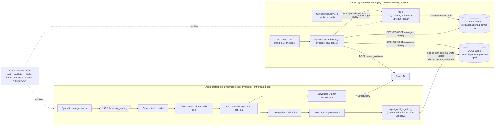

# Architecture

**This is the as-built, verified architecture** — every piece described here
has actually been deployed and run against real infrastructure, not just
designed on paper. Two Databricks targets exist side by side, and the
diagram below is the current (`azure`) one:

## Two Databricks targets, and why both still exist

This project was built in two passes, and rather than throw the first one
away, `databricks.yml` keeps both as bundle targets:

| Target | Workspace | Cost | Gold storage | Synapse can read gold? |
|---|---|---|---|---|
| `dev` | `medallion` (AWS Free Edition) | $0 | Unity Catalog managed (AWS-side) | No -- cross-cloud, see below |
| `azure` | `pharmalake-dbx` (Azure, Premium) | Usage-based, small | External Delta on `stc360legacyws/pharma-gold` | **Yes** |

The reason there are two: **Unity Catalog storage credentials are
cloud-bound** -- a metastore attached to an AWS-hosted workspace cannot
register an Azure ADLS external location, and vice versa. That's not a
config gap, it's a platform limitation. The `dev` target proved the whole
pipeline (bronze → silver → gold → DQ → governance) end to end at zero cost
first; the `azure` target, once real Azure Databricks was provisioned, adds
what only an Azure-hosted workspace can do: gold tables landing in the same
Azure storage Synapse and ADF already use, readable by both without any
data movement between them.

Getting the gold tables into `pharma-gold` took an extra step neither the
first pass nor the initial plan for this pass accounted for: **Lakeflow
serverless pipelines reject an explicit `path=` on a `dlt.table` outright**
once the pipeline is Unity-Catalog-governed --
`Cannot specify an explicit path for a table when using Unity Catalog`,
discovered by actually trying it and reading the pipeline's failed-update
events, not from documentation. Unity Catalog managed tables (even under a
schema with a custom storage root) also use opaque UUID-based paths
internally, not human-readable `<table_name>` folders, so even working
around the first issue wouldn't have produced Synapse-discoverable paths.
The fix: `transforms/gold.py` stays a plain, fully UC-managed pipeline
(identical on both targets -- nothing about `dev` changed), and a separate
notebook, `transforms/09_export_gold_to_adls.py`, runs *after* the pipeline
as an ordinary Spark job (not inside Lakeflow) on the `azure` target only: it
reads each gold table and does a plain `df.write.format("delta").save(<path>)`
plus `CREATE TABLE ... LOCATION`, producing real named-path external Delta
tables in a dedicated `pharma_lakehouse_gold` schema. Verified: `fact_shipment`'s
`storage_location` is exactly `abfss://pharma-gold@stc360legacyws.dfs.core.windows.net/fact_shipment`,
and it's queryable with real row counts (4,000 shipments) both from
Databricks SQL and from Synapse (`sql/synapse_serving_views.sql`, applied
and verified -- see the discoveries section below for what it actually took
to get there).

One tradeoff worth naming: the exported copies in `pharma_lakehouse_gold`
are physically separate Delta tables from the governed originals in
`pharma_lakehouse` -- Unity Catalog masks/row filters (`governance/apply_governance.py`)
apply to the originals, not automatically to the export. Anyone querying
`pharma_lakehouse_gold.*` directly (including via Synapse) sees ungoverned
data. For this project's synthetic dataset that's a documented tradeoff, not
a hidden gap; a production version would re-apply row/column security at the
Synapse view layer too, or restrict who can reach the export schema.

## What's still decoupled, on purpose

ADF's `pl_pharma_orchestrate` pipeline does **not** trigger the Databricks
job, even on the `azure` target. That's not a leftover limitation -- bronze
still ingests synthetic seed data via its own generator (`transforms/00_generate_sample_data.py`),
not the files ADF lands in `pharma-raw`. Wiring ADF to trigger a Databricks
run that processes unrelated synthetic data would be a cosmetic connection,
not a real one. Making ADF's landed extracts (`pharma-raw/drug_batches_from_erp/`,
`pharma-raw/clinical_registry/`) an actual bronze source for Auto Loader is
a legitimate next step (see `transforms/bronze.py`'s `raw_root` config --
it would just need a second Auto Loader source pointed at `pharma-raw`) but
wasn't done here, to keep every claim in this repo backed by something
actually verified running, rather than assembled but untested.

## Layer responsibilities

| Layer | Tool | Responsibility |
|---|---|---|
| Orchestration | Azure Data Factory (existing `adf-c360-legacy`) | Query Synapse serverless (managed identity) + call the public API, land both to ADLS |
| Storage | ADLS Gen2 (existing `stc360legacyws`; new `pharma-raw`, `pharma-gold` containers) | Landing zone for ADF's integration proof + gold serving |
| Transformation | Azure Databricks (`pharmalake-dbx`, Premium, Lakeflow Declarative Pipelines) | Bronze → Silver → Gold, fully UC-managed (Lakeflow can't write named external paths under UC governance) |
| Gold export | Databricks notebook (`transforms/09_export_gold_to_adls.py`) | Plain Spark write, outside Lakeflow: copies gold to named-path external Delta tables on `pharma-gold` |
| Data quality | Databricks notebook (`dq/`) | Post-pipeline completeness/uniqueness/referential-integrity/freshness checks, logged to `dq_results`, fails the job on any failure |
| Governance | Unity Catalog (`governance/`) | Column masks, row filters, classification tags |
| Serving (raw) | Synapse Serverless SQL (existing `synapse-c360-legacy`) | T-SQL views over the ADF-landed raw extracts |
| Serving (gold) | Synapse Serverless SQL **and** Databricks SQL | Same gold Delta data, reachable both ways -- Synapse via `OPENROWSET`, Power BI via DirectQuery |
| Governance identity | Databricks Access Connector (`pharmalake-uc-access-connector`) | The managed identity Unity Catalog's storage credential authenticates as |
| Visualization | Power BI | DirectQuery to Databricks SQL, star schema, DAX measures |
| IaC | Bicep (`infra/main.bicep` + `infra/rbac.bicep`) | Databricks workspace, access connector, containers, budget alert; RBAC kept in its own file |
| Cost control | `Microsoft.Consumption/budgets` (`infra/main.bicep`) | $25/month budget on the resource group, email alerts at 50/80/100% |
| CI/CD | Azure DevOps (`devops/azure-pipelines.yml`) | test → validate → deploy infra (approval-gated) → deploy lakehouse → deploy ADF |

## Why Bicep instead of Terraform

The JD lists Terraform as a **preferred**, not required, skill. Bicep is the
Azure-native equivalent (declarative, idempotent, state-free — Azure itself
tracks resource state, no remote state backend to manage) and every concept
here (resources, modules, parameters, outputs, referencing `existing`
resources, RBAC role assignments) maps directly onto Terraform if the target
environment requires it.

## Why the RBAC role assignments are a separate file

`infra/rbac.bicep` holds all storage role assignments -- ADF's identity, the
access connector's identity, **and Synapse workspace's own identity**, all
granted "Storage Blob Data Contributor" on `stc360legacyws` -- instead of
living in `main.bicep`. Granting IAM/access-control permissions is
categorically different from provisioning a resource -- it changes who can
read/write existing data, not just what exists -- so it's kept reviewable
and deployable on its own rather than bundled into a template that otherwise
touches nothing sensitive. The Synapse grant wasn't in the original plan --
it only became obvious as a gap when `CREATE DATABASE SCOPED CREDENTIAL ...
WITH IDENTITY = 'Managed Identity'` in `sql/synapse_serving_views.sql`
turned out to authenticate as the *workspace's* identity, not the querying
user's -- see the next section.

## Discoveries from testing this for real

Every item here was found by actually running the pipeline against live
infrastructure and reading the exact error, not from documentation. Listed
in the order they were hit, because each one only became visible after
fixing the last:

1. **`LocalFilesystemAccessDeniedException` on `dbutils.fs.cp`.** Serverless
   compute blocks `dbutils` access to the driver's local filesystem --
   staging synthetic data to `/tmp` then copying to a UC Volume (a pattern
   that works fine on classic clusters) fails outright. Fix: write straight
   to `/Volumes/...` with plain Python `open()` (`transforms/00_generate_sample_data.py`).
2. **Lakeflow rejects an explicit `path=` on a UC-governed `dlt.table`.**
   Covered above -- led to the separate `export_gold_to_adls.py` step.
3. **Storage RBAC alone doesn't let ADF query Synapse.** `Login failed for
   user '<token-identified principal>'` -- managed-identity storage access
   and a SQL *login* inside the target database are two separate grants.
   Fix: `CREATE USER [adf-c360-legacy] FROM EXTERNAL PROVIDER;`.
4. **A SQL login with `db_datareader` still isn't enough for ADF's Copy
   Activity.** `You do not have permission to use the bulk load statement.`
   -- ADF's SQL source connector uses bulk-load semantics under the hood
   regardless of query shape. Fix: `GRANT ADMINISTER DATABASE BULK
   OPERATIONS`.
5. **Querying a view doesn't inherit permission on the credential its
   `OPENROWSET` depends on.** `Cannot find the CREDENTIAL 'cred_adls' ...
   or you do not have permission` -- ownership chaining didn't extend to
   the database-scoped credential object itself. Fix: `GRANT REFERENCES ON
   DATABASE SCOPED CREDENTIAL::cred_adls`.
6. **`CREATE DATABASE SCOPED CREDENTIAL` requires a database master key
   first**, even for a Managed-Identity credential with no secret of its
   own to encrypt -- `Please create a master key in the database...`. Fix:
   `CREATE MASTER KEY ENCRYPTION BY PASSWORD = '...'` before the credential
   (a real, randomly generated password used once at execution time --
   never committed; the checked-in script has a placeholder).
7. **Deletion vectors break Synapse's Delta reader entirely.** Databricks
   Runtime enables `delta.enableDeletionVectors` by default on new tables
   (protocol reader v3 / writer v7). Synapse serverless SQL's `FORMAT =
   'DELTA'` reader only understands the older protocol, and fails with
   `Content of directory on path '.../_delta_log/*.*' cannot be listed`
   (13807) -- which reads exactly like a permissions error and isn't one,
   confirmed by successfully reading the same files as plain Parquet with
   identical credentials. Fix: `.option("delta.enableDeletionVectors",
   "false")` at write time in `export_gold_to_adls.py`, plus wiping the
   target path first so a previous run's protocol can't linger.
8. **ADF's Copy Activity writes an extensionless filename when the sink
   dataset only specifies a folder path.** `dbo.batch_master`'s `OPENROWSET
   BULK 'drug_batches_from_erp/*.csv'` silently matched zero files (no
   error -- just 0 rows) even though ADF's own run diagnostics showed
   `rowsCopied: 500`. Fix: wildcard on `*`, not `*.csv`.

None of these are exotic -- every one is the kind of gap that only shows up
once you stop at "the deploy succeeded" and actually run the thing.

## Cost: real numbers, not just estimates

- **`pharmalake-dbx` (Azure Databricks, Premium):** the workspace itself is
  free -- Azure Databricks has no flat fee for the workspace resource, only
  for compute actually used. A full pipeline run (bronze → silver → gold →
  DQ → governance → gold export) took under 5 minutes end to end on
  serverless compute, run several times over while building and debugging
  this (including one run that hit the Lakeflow path-discriminator issue
  above and failed after ~12 minutes of retries) -- realistic total across
  every run in this build: comfortably under $5.
- **Unity Catalog / storage credential / external location:** free --
  metadata objects, no separate charge.
- **`medallion` (AWS Free Edition):** still $0, kept as the `dev` target.
- **ADF, Synapse serverless, storage:** all pre-existing resources reused
  as-is -- no new Data Factory, SQL server, or storage account. New spend is
  the marginal usage cost of one extra pipeline (pennies/run) plus a few KB
  of blob storage.
- **Safety net:** a $25/month budget (`infra/main.bicep`) alerts
  `vivekt94@gmail.com` at 50/80/100% of threshold -- catches a forgotten
  always-on resource before it compounds, independent of whether the actual
  usage stays near $0 as expected.
